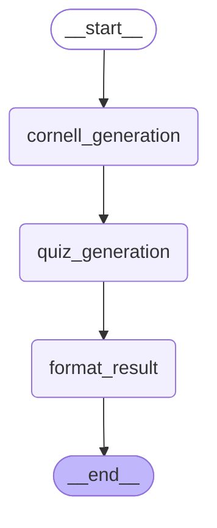

# Papers RAG Agent

<!-- CLOUDRUN_URL_START -->
🚀 **Live Demo**: [https://papers-rag-ui-xxxxx-an.a.run.app](https://papers-rag-ui-xxxxx-an.a.run.app)
<!-- CLOUDRUN_URL_END -->

このプロジェクトは **論文学習に特化した RAG × LangGraphワークフロー型チャットボット** です。
ユーザーが論文タイトルや質問を入力すると、以下の処理が行われます。

## 📋 現在実装済みの機能

### メッセージルーティング

ユーザー入力を自動分類し、ArXiv検索またはRAG質問処理に適切にルーティングします。

### RAGパイプライン

* arXivから論文メタデータを取得し、タイトルとアブストラクトをベクトル化してインメモリ検索
* HyDE（Hypothetical Document Embeddings）による検索クエリ拡張
* Support値に基づく回答品質評価と自動再試行

### Corrective RAG（CRAG）

HyDEを使った自己補正RAGシステム：

1. ベースライン検索でSupport値を評価
2. 閾値未満の場合、HyDEでクエリを拡張して再検索
3. LangGraphワークフローによる透明性の高い処理フロー

### コンテンツ強化

検索結果をもとに以下を並列生成：

* **Cornell Note形式（Cue / Notes / Summary）** による構造化要約
* 理解度チェック用の **3問クイズ** （選択肢付き）

## 🔄 リアルタイム処理表示

**NEW**: LangGraphワークフローの途中結果をリアルタイムで表示する機能を追加しました：

* **メッセージ分類**: 入力がRAG質問かArXiv検索かを自動判別
* **ベースライン検索**: 初回検索結果とSupport値を表示
* **HyDE拡張**: Support値が低い場合の拡張クエリ生成過程
* **拡張検索**: HyDE後の改善されたSupport値と改善度
* **回答生成**: 最終回答のストリーミング表示

これにより、ユーザーはRAGの処理過程を透明性高く確認できます。

## 🚀 将来実装予定の機能

### GraphRAG + ベクトルハイブリッド検索

* PDFテキスト化とIMRaD構造チャンク化
* 知識グラフによる概念間関係性探索
* ベクトル検索とGraph検索の動的切り替え・統合
* FAISSベクトルDBによる高速検索

### Multi-Agent Cooperation（Aime / TreeQuest思想）

* 複数の専門エージェント（例: 領域専門／数理的厳密性／引用重視）による候補回答生成
* **批判エージェント（Critic）**による各候補の評価
* **統合エージェント（Integrator）**による最終回答決定
* エージェント間の合議システムによる回答品質向上

### 専用エージェント群

* Query Planner: 高度なクエリ解析・拡張
* Judge: 回答品質の詳細評価
* Experts: 分野特化型専門エージェント
* Critics & Integrator: 多角的評価・統合システム

## 🚀 クイックスタート

### 必須要件

1. **OpenAI API Key の設定**

   ```bash
   export OPENAI_API_KEY="your_api_key_here"
   ```

2. **依存関係のインストール**

   ```bash
   uv sync
   ```

3. **アプリケーションの起動**

   ```bash
   uv run chainlit run src/ui/app.py -w
   ```

詳細なセットアップ手順は [`docs/guides/setup.md`](docs/guides/setup.md) をご確認ください。

## 🔄 LangGraph ワークフロー図

<!-- TODO: Mermaid図の自動更新機能を実装
     現在は手動でコピーしているが、以下の機能を実装予定：
     1. scripts/update_readme_with_graphs.py - READMEマーカー方式での自動更新
     2. Taskfile統合 - task docs:update コマンドでの更新
     3. GitHub Actions - グラフ変更時の自動PR作成
     関連: scripts/generate_mermaid_graphs.py (既存)
-->

Papers RAG Agentは複数のLangGraphワークフローで構成されています：

### メッセージルーティングワークフロー

ユーザーの入力を解析し、適切な処理パイプライン（ArXiv検索またはRAG処理）にルーティングします。


### 補正RAGワークフロー

HyDE（Hypothetical Document Embeddings）を使用した自己補正RAGシステムです。


### コンテンツ強化ワークフロー

RAG回答をCornell Note形式とクイズ問題で強化します。



> 📊 詳細なワークフロー図は [`docs/graphs/`](docs/graphs/) ディレクトリで確認できます。

---

## 📊 現在の機能確認

**Chainlit UI** を通じて以下を確認できます:

### ✅ 実装済み機能

* 質問に対する引用付き回答
* Cornell Note形式の出力（Cue / Notes / Summary）
* 自動生成された3問クイズ（選択肢付き）
* **Corrective RAG（CRAG）**の実行履歴とSupport値表示
* LangGraphワークフローの透明性の高い処理過程表示
* ArXiv検索とRAG質問の自動ルーティング

### 🔄 将来実装予定

* 複数エージェントの候補・批評・合議結果
* 検索モード（ベクトル／Graph）切替の可視化
* 高度なJudgeシステムによる詳細な品質評価

> 📈 評価システム（LangSmith EvalsやRAGAS）は次フェーズで導入予定

---

## 📁 フォルダ構成

### 現在の実装構造

```tree
papers-rag-agent/
├── src/
│   ├── graphs/                # ✅ LangGraph ワークフロー定義
│   │   ├── message_routing.py    # メッセージルーティング
│   │   ├── corrective_rag.py     # Corrective RAG (CRAG)
│   │   └── content_enhancement.py # Cornell Note・Quiz生成
│   ├── retrieval/             # ✅ 検索システム
│   │   ├── arxiv_searcher.py     # arXiv検索API
│   │   └── inmemory.py           # インメモリベクトル検索
│   ├── llm/                   # ✅ LLM関連機能
│   │   ├── embeddings.py         # OpenAI Embeddings
│   │   ├── generator.py          # 回答生成
│   │   └── hyde.py              # HyDE実装
│   ├── pipelines/             # ✅ RAGパイプライン
│   │   ├── baseline.py           # ベースラインRAG
│   │   └── corrective.py         # 補正RAG
│   ├── ui/                    # ✅ Chainlit UI
│   │   ├── app.py               # メインアプリ
│   │   ├── components.py        # UI コンポーネント
│   │   └── send.py             # メッセージ送信
│   ├── data/                  # ✅ データ・キャッシュ
│   │   ├── cache_loader.py      # プリコンピュート済みキャッシュ
│   │   └── precomputed_embeddings.pkl
│   ├── adapters/              # ✅ アダプター層
│   │   └── mock_agent.py        # モック実装
│   ├── utils/                 # ✅ ユーティリティ
│   │   └── language_utils.py    # 言語処理
│   ├── models.py              # ✅ 共通データモデル
│   └── config.py              # ✅ 設定管理
├── tests/                     # ✅ テストコード
├── scripts/                   # ✅ 補助スクリプト
│   ├── build_cache.py           # キャッシュ構築
│   └── generate_mermaid_graphs.py # 図表生成
├── docs/                      # ✅ ドキュメント
│   ├── graphs/                  # ワークフロー図
│   └── guides/                  # セットアップ・LangGraph・Chainlitなどのガイド
├── README.md
├── pyproject.toml
└── uv.lock
```

### 🔄 将来の構成予定

```tree
papers-rag-agent/
├── src/
│   ├── agents/                # 🚧 専用エージェント群（実装予定）
│   │   ├── query_planner.py     # クエリ解析・拡張
│   │   ├── judge.py            # 回答品質評価
│   │   ├── experts/            # 分野特化エージェント
│   │   ├── critic.py           # 批判・評価エージェント
│   │   └── integrator.py       # 統合・合議エージェント
│   └── knowledge/             # 🚧 GraphRAG関連（実装予定）
│       ├── graph_builder.py    # 知識グラフ構築
│       └── graph_searcher.py   # グラフ検索
├── data/                      # 🚧 サンプル論文PDF（実装予定）
│   └── sample_papers/
```
