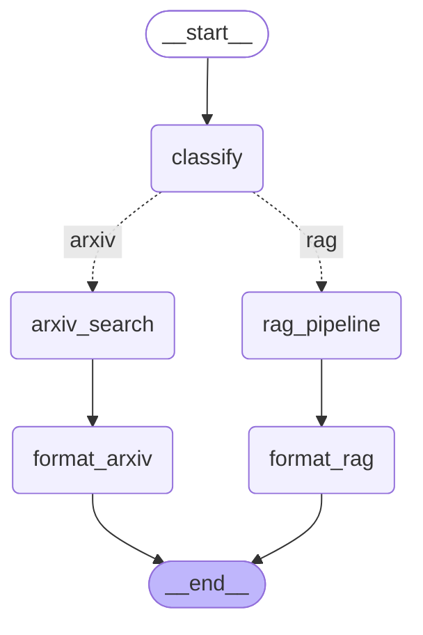
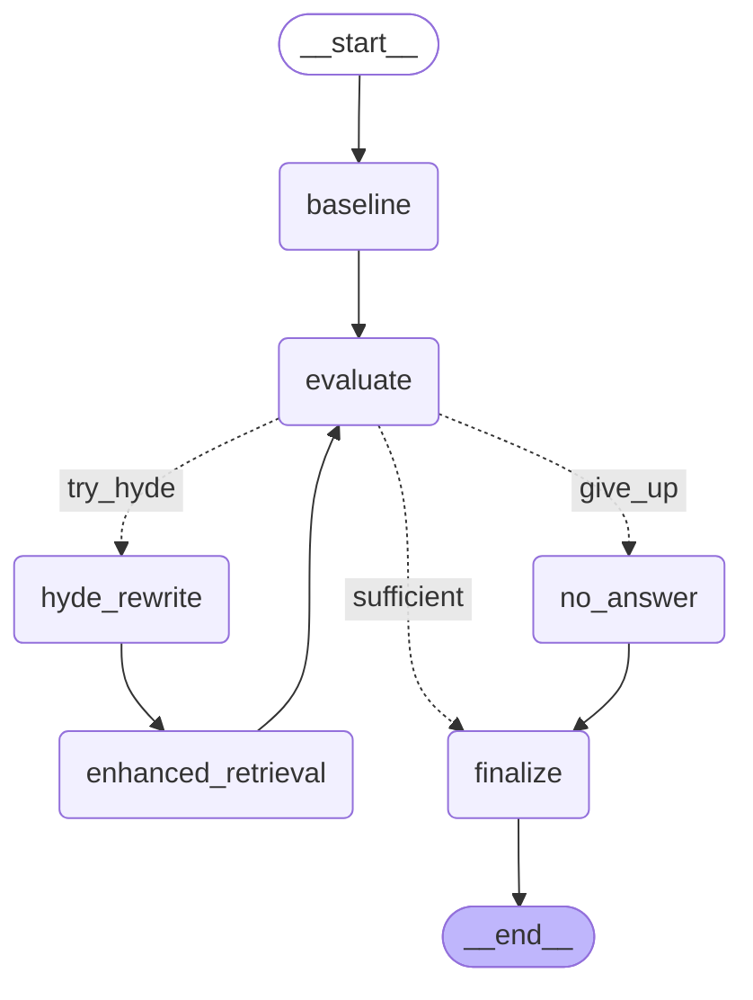

# Papers RAG Agent

<!-- CLOUDRUN_URL_START -->
🚀 **Live Demo (Chainlit UI)**: [https://papers-rag-ui-74fhp6jaca-an.a.run.app](https://papers-rag-ui-74fhp6jaca-an.a.run.app)
<!-- CLOUDRUN_URL_END -->

English | 日本語版: [docs/ja/README.md](docs/ja/README.md)

Papers RAG Agent is a workflow-driven chatbot for learning from academic
papers. It combines Retrieval Augmented Generation (RAG) with LangGraph
workflows to provide cited answers, Cornell Notes, and comprehension
quizzes.

## 📋 Implemented Features

### Message Routing

Classifies user input and routes it to ArXiv search or the RAG question workflow.

### RAG Pipeline

- Fetches paper metadata from arXiv, embeds titles and abstracts, and searches in-memory
- HyDE (Hypothetical Document Embeddings) for query rewriting
- Support score evaluation with automatic retries

### Corrective RAG (CRAG)

Self-correcting RAG using HyDE:

1. Run baseline retrieval and evaluate support
1. If below threshold, rewrite query via HyDE and retry
1. Transparent workflow via LangGraph

### Content Enhancement

Generates in parallel:

- Structured summary in Cornell Note format (Cue / Notes / Summary)
- Three multiple-choice quiz questions

## 🔄 Real-time Progress

- Message classification: detect RAG question vs ArXiv search
- Baseline retrieval: show results and support score
- HyDE expansion: show rewritten query when support is low
- Enhanced retrieval: show improved support and delta
- Answer generation: stream the final answer

This makes the RAG process transparent to users.

## 🛠️ Local Development

### Prerequisites

- Python 3.13+
- [uv](https://docs.astral.sh/uv/) package manager
- OpenAI API Key

### Setup

1. Install dependencies

   ```bash
   task setup
   ```

1. Configure environment variables

   ```bash
   cp env.example .env
   # edit .env and set OPENAI_API_KEY
   ```

1. Build cache (first run only)

   ```bash
   task build:cache
   ```

### Run

#### Option 1: Docker Compose (recommended)

```bash
docker compose up -d

# Access
# - Chainlit UI: http://localhost:8000
# - FastAPI:     http://localhost:9000
```

#### Option 2: Local processes

```bash
# Terminal 1: FastAPI server
task api

# Terminal 2: Chainlit UI
task ui

# Access
# - Chainlit UI: http://localhost:8000
# - FastAPI:     http://localhost:9000
```

## 📄 arXiv Content Retrieval (Optional)

This project supports optional full-text paper retrieval using
[arxiv-mcp-server](https://github.com/blazickjp/arxiv-mcp-server).
When enabled, the system can:

- Fetch and extract full text from arXiv PDFs
- Cache paper content with configurable TTL
- Prefetch content for top-ranked papers in digest
- Provide section-level metadata (headings, structure)
- Serve full text via dedicated endpoint

### Setup MCP Integration

1. Install arxiv-mcp-server:

   ```bash
   uv tool install arxiv-mcp-server
   ```

2. Enable in `.env`:

   ```bash
   ARXIV_MCP_ENABLE=true
   ARXIV_PREFETCH_TOPK=10
   ARXIV_CACHE_TTL_DAYS=7
   ```

3. Content is cached at `~/.arxiv-mcp-server/papers/cache/` by default

### Content Endpoints

- `GET /digest/{paper_id}/details` - Returns section metadata (headings,
  offsets, snippets), NOT full text
- `GET /digest/{paper_id}/fulltext?format=plain&max_bytes=200000` - Returns
  full text content with optional truncation

### Available Tasks

```bash
# Development
task api          # start FastAPI only
task ui           # start Chainlit UI only
task dev:local    # show local dev help

# Tests
task test
task test:unit
task test:integration

# Cache
task build:cache
task cache:info
task cache:clean

# Quality
task lint
task format
task check
```

## 🚀 Roadmap

### GraphRAG + Vector Hybrid

- PDF parsing and IMRaD-aware chunking
- Knowledge graph for concept relationships
- Dynamic switching/combination of vector and graph search
- FAISS-based vector DB

### Multi-Agent Cooperation (Aime / TreeQuest-inspired)

- Multiple expert agents propose answers
- Critic agent evaluates candidates
- Integrator agent selects final answer
- Consensus to improve quality

### Specialized Agents

- Query Planner
- Judge
- Domain Experts
- Critics & Integrator

## 🚀 Quick Start

1. Set OpenAI API Key

   ```bash
   export OPENAI_API_KEY="your_api_key_here"
   ```

1. Install dependencies

   ```bash
   uv sync
   ```

1. Launch Chainlit

   ```bash
   uv run chainlit run src/ui/app.py -w
   ```

See detailed setup in [`docs/guides/setup.md`](docs/guides/setup.md).

## 🔄 LangGraph Workflows

Papers RAG Agent is composed of several LangGraph workflows.

### Message Routing Workflow



### Corrective RAG



### Content Enhancement Workflow


See more diagrams in [`docs/graphs/`](docs/graphs/).

## 📊 Feature Verification via UI

- Cited answers to questions
- Cornell Note output (Cue / Notes / Summary)
- Three auto-generated MCQs
- Corrective RAG support score with history
- Transparent workflow progress
- Auto routing between ArXiv search and RAG

## 📁 Project Structure

```tree
papers-rag-agent/
├── src/
│   ├── graphs/                   # LangGraph workflows
│   │   ├── message_routing.py
│   │   ├── corrective_rag.py
│   │   └── content_enhancement.py
│   ├── retrieval/                # Retrieval system
│   │   ├── arxiv_searcher.py
│   │   └── inmemory.py
│   ├── llm/                      # LLM utilities
│   │   ├── embeddings.py
│   │   ├── generator.py
│   │   └── hyde.py
│   ├── pipelines/                # RAG pipelines
│   │   ├── baseline.py
│   │   └── corrective.py
│   ├── ui/                       # Chainlit UI
│   │   ├── app.py
│   │   ├── components.py
│   │   └── send.py
│   ├── data/                     # Precomputed cache
│   │   ├── cache_loader.py
│   │   └── precomputed_embeddings.pkl
│   ├── adapters/                 # Adapters
│   │   └── mock_agent.py
│   ├── utils/                    # Utilities
│   │   └── language_utils.py
│   ├── models.py                 # Shared data models
│   └── config.py                 # Configuration
├── tests/                        # Test suite
├── scripts/                      # Helper scripts
│   ├── build_cache.py
│   └── generate_mermaid_graphs.py
├── docs/                         # Documentation
│   ├── graphs/
│   └── guides/
├── README.md
├── pyproject.toml
└── uv.lock
```

## 🔄 Planned Structure

```tree
papers-rag-agent/
├── src/
│   ├── agents/                   # Planned specialized agents
│   │   ├── query_planner.py
│   │   ├── judge.py
│   │   ├── experts/
│   │   ├── critic.py
│   │   └── integrator.py
│   └── knowledge/                # Planned GraphRAG
│       ├── graph_builder.py
│       └── graph_searcher.py
├── data/                         # Planned sample PDFs
│   └── sample_papers/
```
