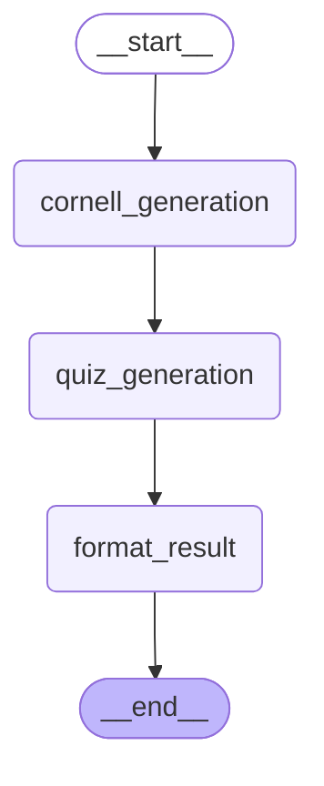

# Content Enhancement Workflow

Post-processing workflow to generate Cornell notes and quiz questions

```mermaid
---
config:
  flowchart:
    curve: linear
---
graph TD;
	__start__([<p>__start__</p>]):::first
	cornell_generation(cornell_generation)
	quiz_generation(quiz_generation)
	format_result(format_result)
	__end__([<p>__end__</p>]):::last
	__start__ --> cornell_generation;
	cornell_generation --> quiz_generation;
	quiz_generation --> format_result;
	format_result --> __end__;
	classDef default fill:#f2f0ff,line-height:1.2
	classDef first fill-opacity:0
	classDef last fill:#bfb6fc

```
