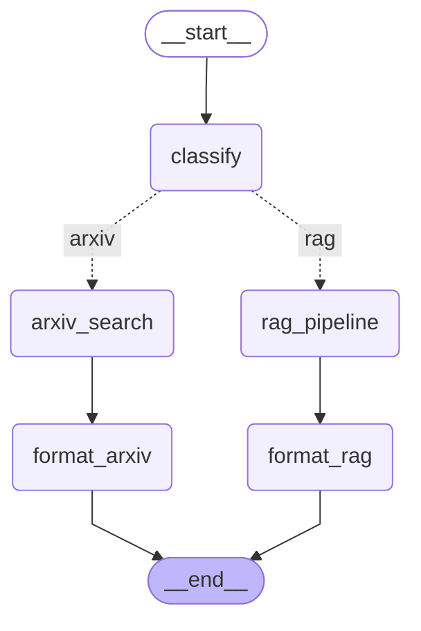

# Message Routing Workflow

Main workflow for routing user messages to appropriate processors

```mermaid
---
config:
  flowchart:
    curve: linear
---
graph TD;
	__start__([<p>__start__</p>]):::first
	classify(classify)
	arxiv_search(arxiv_search)
	rag_pipeline(rag_pipeline)
	format_arxiv(format_arxiv)
	format_rag(format_rag)
	__end__([<p>__end__</p>]):::last
	__start__ --> classify;
	arxiv_search --> format_arxiv;
	classify -. &nbsp;arxiv&nbsp; .-> arxiv_search;
	classify -. &nbsp;rag&nbsp; .-> rag_pipeline;
	rag_pipeline --> format_rag;
	format_arxiv --> __end__;
	format_rag --> __end__;
	classDef default fill:#f2f0ff,line-height:1.2
	classDef first fill-opacity:0
	classDef last fill:#bfb6fc

```
